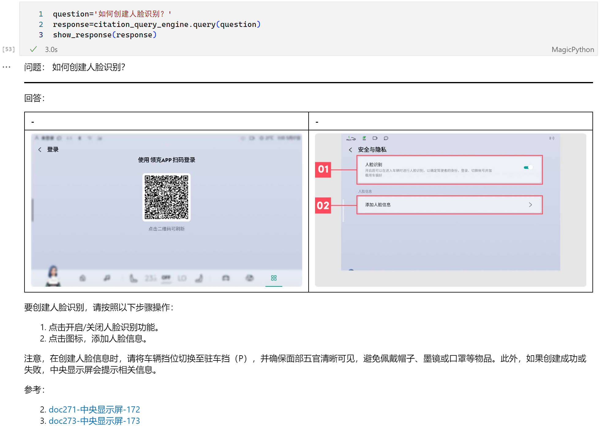

本项目基于[天池比赛项目](https://tianchi.aliyun.com/competition/entrance/532154/information)的数据，开发针对文档的智能问答助手

任务：本次比赛要求参赛选手以大模型为中心制作一个问答系统，回答用户的汽车相关问题。参赛选手需要根据问题，在文档中定位相关信息的位置，并根据文档内容通过大模型生成相应的答案。本次比赛涉及的问题主要围绕汽车使用、维修、保养等方面，具体可参考下面的例子：

问题1：怎么打开危险警告灯？
答案1：危险警告灯开关在方向盘下方，按下开关即可打开危险警告灯。

问题2：车辆如何保养？
答案2：为了保持车辆处于最佳状态，建议您定期关注车辆状态，包括定期保养、洗车、内部清洁、外部清洁、轮胎的保养、低压蓄电池的保养等。

问题3：靠背太热怎么办？
答案3：您好，如果您的座椅靠背太热，可以尝试关闭座椅加热功能。在多媒体显示屏上依次点击空调开启按键→座椅→加热，在该界面下可以关闭座椅加热。

**项目难点**

1. 提供文档为pdf，采样双列布局，包含图片
2. 生成的答案包含图片
3. 生成的答案包含引文

**文件介绍**

- [parsePdf](1-parsePdf.ipynb) ：解析原始的pdf文档，拆成多份md文件
- [evaluate_retrievers](2-evaluate_retrievers.ipynb)：构建检索器及其评估过程，确定最终检索器
- [evaluate_query_engine](3-evaluate_query_engine.ipynb)：构建生成器及其评估过程
- [RetrieverQueryEngine](RetrieverQueryEngine.ipynb)：经过以上探索，选择合适方式实现文档检索

**效果**

